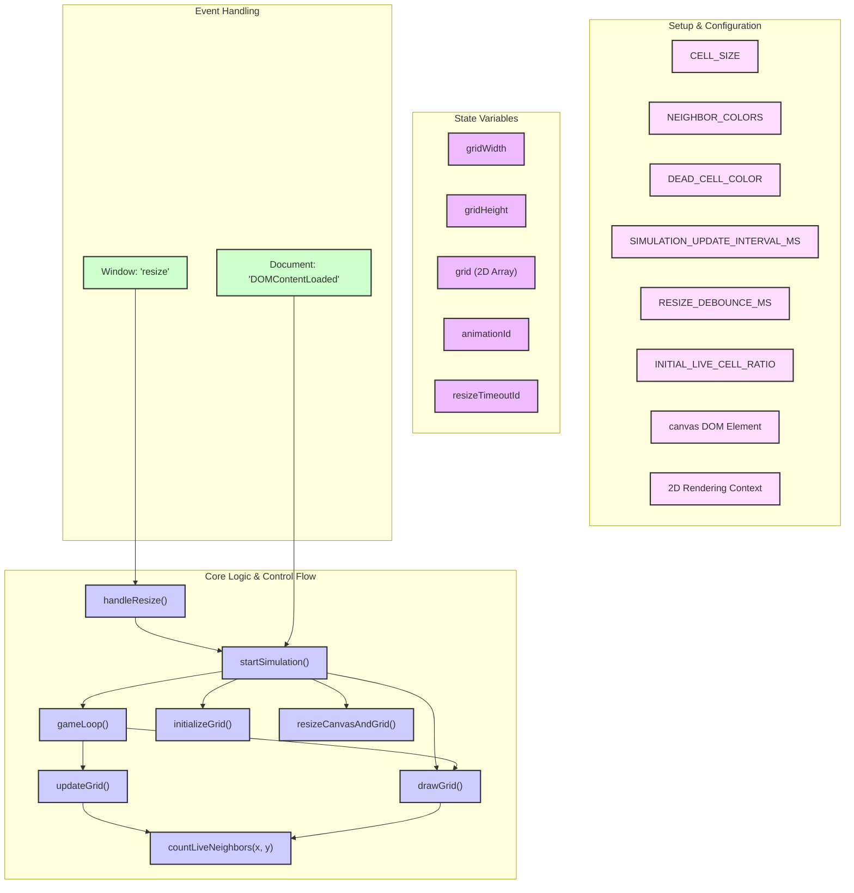

# Conway's Game of Life

This project is an interactive, browser-based simulation of Conway's Game of Life, a cellular automaton devised by the British mathematician John Horton Conway in 1970. It's a zero-player game, meaning its evolution is determined by its initial state, requiring no further input. One interacts with the Game of Life by creating an initial configuration and observing how it evolves.

## Implementation Summary

This implementation is built purely with web technologies:
-   **`index.html`**: Provides the basic structure of the web page, including the canvas element where the game is rendered.
-   **`styles.css`**: Contains all the styling rules, making the simulation full-screen and defining the visual appearance of the cells and background.
-   **`script.js`**: Houses all the logic for the Game of Life, including grid initialization, drawing, applying game rules, and handling responsiveness.

### Key Features:
-   **Responsive Design**: The simulation dynamically adjusts to the browser window size, reinitializing the grid to fit.
-   **GitHub-Themed Colors**: Live cells are colored using a palette inspired by GitHub's contribution graph, with color intensity varying based on the number of live neighbors.
-   **Toroidal Grid**: The grid boundaries wrap around (toroidal array), meaning cells on one edge of the grid consider cells on the opposite edge as their neighbors.
-   **Dynamic Simulation**: The game state updates every 0.5 seconds, allowing observation of evolving patterns.
-   **Standardized Code**: The codebase adheres to guidelines outlined in `.github/copilot-instructions.md`, including JSDoc commenting for JavaScript functions.

## Running the Application

To run the simulation:
1.  Clone or download this repository to your local machine.
2.  Navigate to the project's root directory.
3.  Open the `index.html` file in any modern web browser (e.g., Chrome, Firefox, Safari, Edge).

No build steps or external dependencies are required.

## Code Structure Overview (Conceptual)

The JavaScript code (`script.js`) is organized around several key functions and state variables. Here's a conceptual overview:

**Explanation of Diagram:**
-   **Setup & Configuration**: Global constants and references to DOM elements defining core parameters and rendering context.
-   **State Variables**: Mutable variables holding the grid dimensions, the grid data structure, and IDs for managing animation and timeouts.
-   **Core Logic & Control Flow**: Functions responsible for the simulation's mechanics, initialization, and dynamic updates.
    -   `startSimulation()`: Orchestrates the setup and initiation of the game loop.
    -   `gameLoop()`: The recurring cycle that updates and redraws the grid.
    -   `updateGrid()`: Applies Conway's rules to determine the next cell states.
    -   `drawGrid()`: Renders the current state of the grid onto the canvas.
    -   `countLiveNeighbors()`: Calculates live neighbors for a cell using toroidal logic.
    -   `initializeGrid()`: Populates the grid with an initial random configuration of cells.
    -   `resizeCanvasAndGrid()`: Adjusts canvas dimensions and grid parameters upon window resize.
    -   `handleResize()`: Manages window resize events, typically debouncing `startSimulation`.
-   **Event Handling**: Listeners for browser/document events that trigger core logic.

## Contributing

Contributions are welcome! If you'd like to improve the simulation or add new features:
1.  Fork the repository.
2.  Create a new branch for your changes.
3.  Make your modifications, ensuring they align with the coding standards outlined in `.github/copilot-instructions.md`.
4.  Submit a pull request with a clear description of your changes.

---
*This Conway's Game of Life simulation was developed as part of a guided project and has been progressively refined.*
